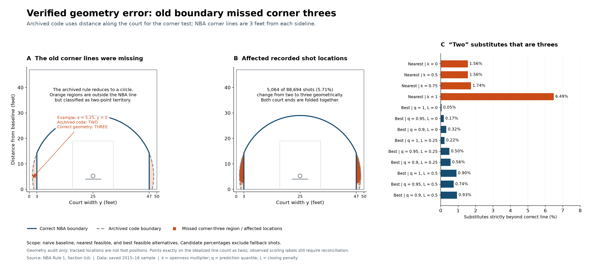
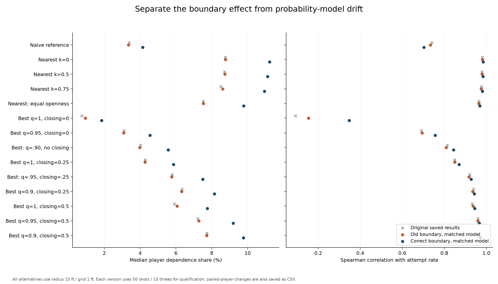
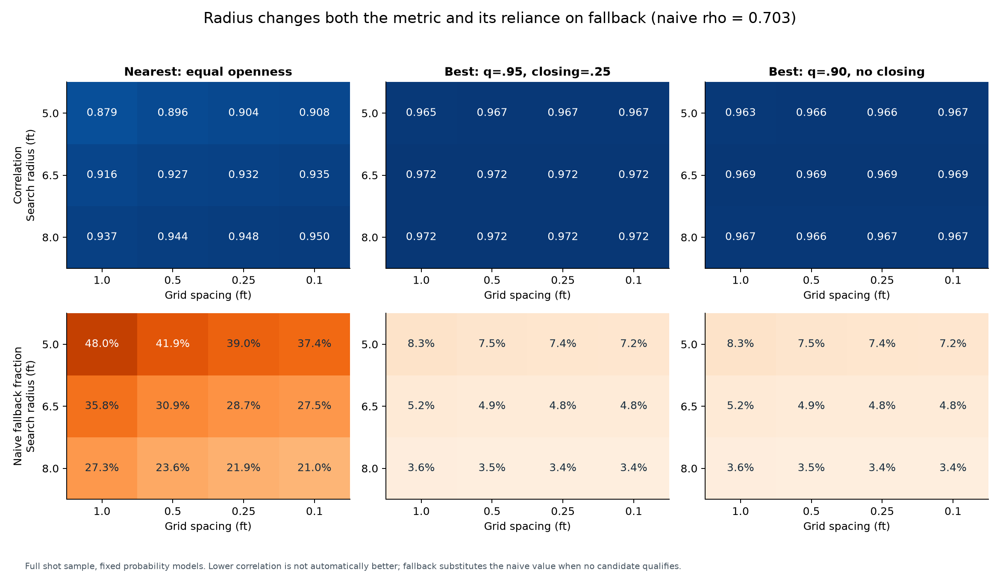
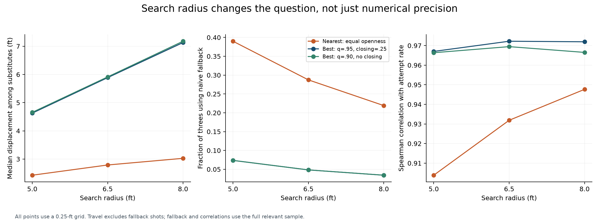
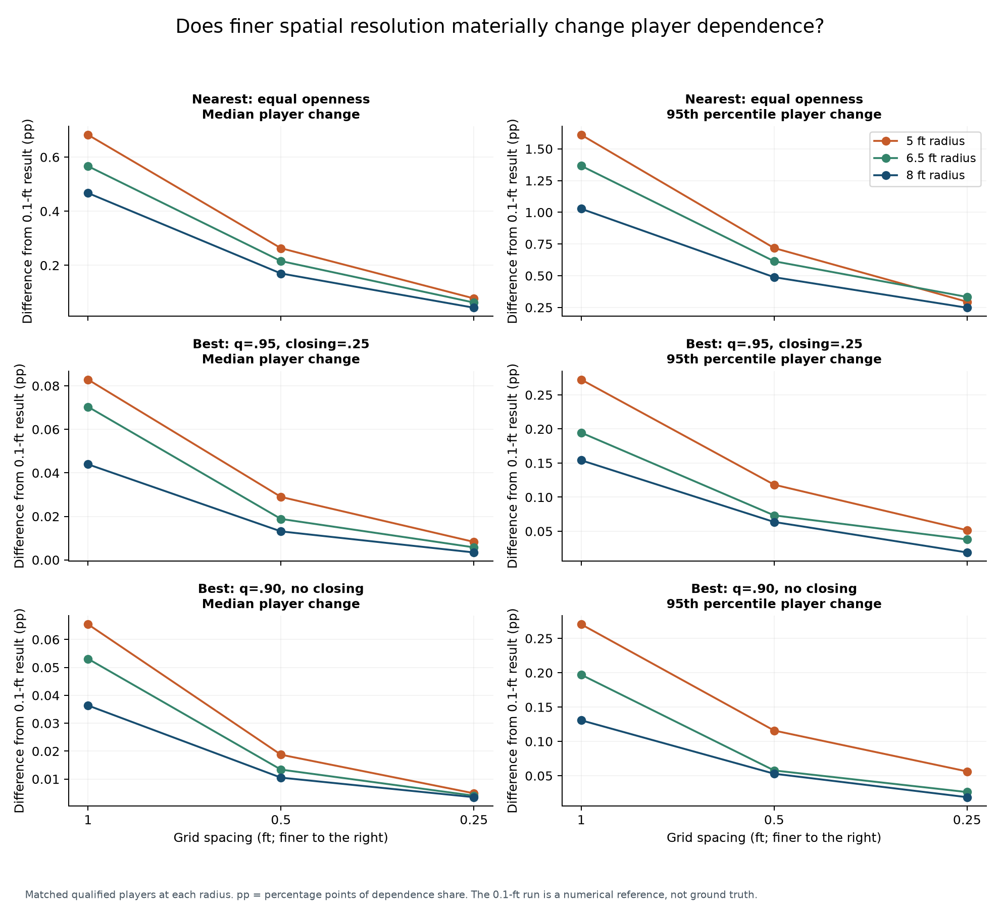
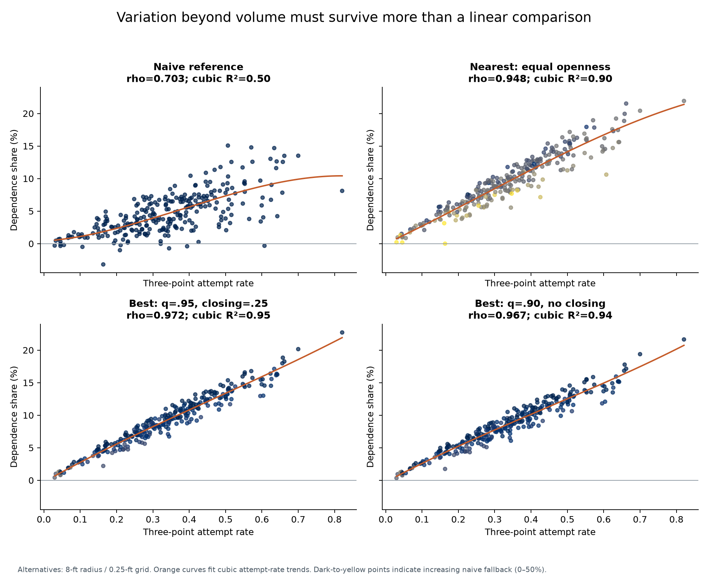
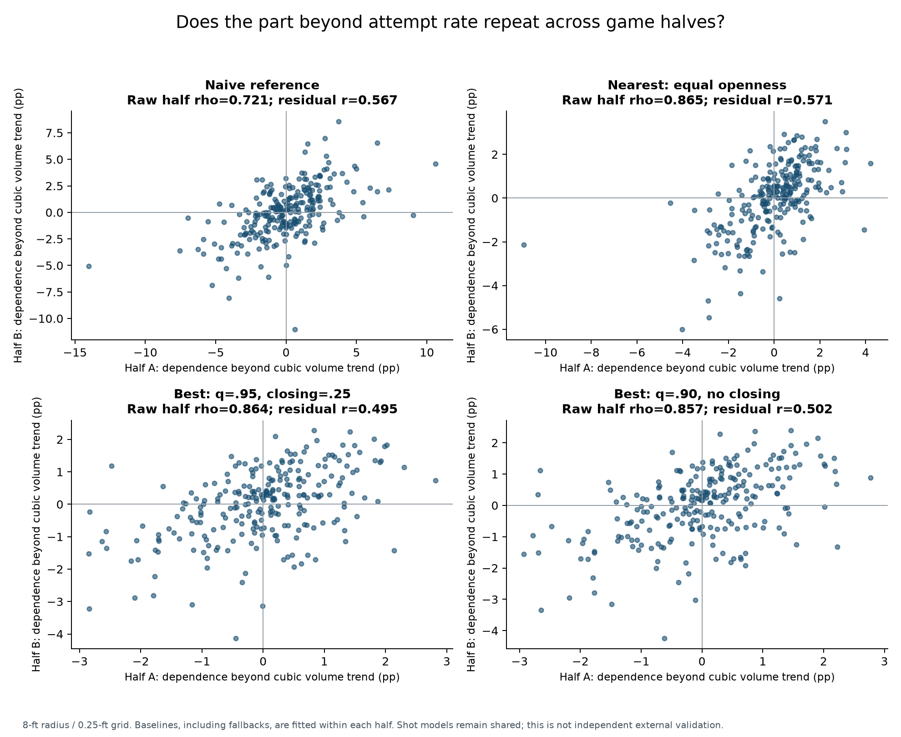
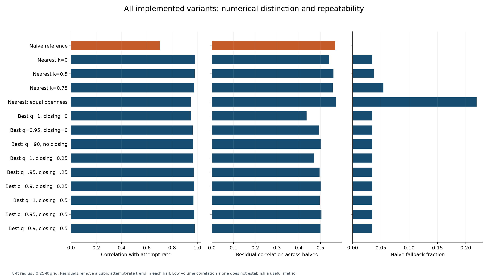

# Three-point geometry, candidate search, and dependence evaluation

See also [the additional matched-player, forward-time, and placebo validation](dependence_validation.md). These tests assess incremental usefulness beyond the earlier correlation and split-half diagnostics.

Updated 12 September 2026. This report documents the corrected boundary and the published candidate-search sensitivity analysis. The implemented alternatives evaluated here are the naive baseline, nearest feasible two, and best feasible two.

## Finding

**`dep_share` is a useful provisional description of expected scoring lost under a specified replacement rule. It is not a volume-independent measure of a player's need to shoot threes.** The naive version has appreciably more separation from attempt rate than the local nearest/best alternatives. The alternatives contain repeatable residual differences beyond attempt rate, but those differences do not establish that their hypothetical substitutes are realistic.

The working candidate search now uses **an 8 ft radius and a 0.25 ft grid**. All 5, 6.5, and 8 ft radius results at 1, 0.5, 0.25, and 0.1 ft spacing are retained, along with the corrected 15 ft / 1 ft reference. This is a practical sensitivity-analysis default, not a validated movement model or a radius selected to minimize correlation with attempt rate.

## What was corrected and rebuilt

The shared boundary in `src/nba_geometry.py` uses the 23.75 ft arc and the two parallel corner lines 3 ft from each sideline, following [NBA Rule 1, Section I(d)](https://official.nba.com/rule-no-1-court-dimensions-equipment/). In this repository's coordinates, court length is x and width is y. The corner lines are **y = 3 and y = 47**, not tests on distance along the court. The left basket is at (5.25, 25), and the right is at (88.75, 25).

For the appropriate basket, a tracked point is a three if either its lateral distance from y = 25 exceeds 22 ft, or its distance from the basket exceeds 23.75 ft. Exact boundary points are treated as twos, with a numerical tolerance. The arc joins each straight segment about 14.20 ft from the baseline. The old rule missed the strips outside y = 3 or 47 that were still inside the full circle, at both court ends.

The correction is used both for observed geometric labels and for candidate eligibility. Of **88,694 shots in 531 games**, geometric threes increase from **19,242 to 24,306**: **5,064 two-to-three changes**, or 5.71% of the sample. There are no three-to-two changes. Among the changed shots, the source play-by-play labels record 4,892 as threes and 172 as twos. Thus these are still **program-derived coordinate labels**, not a claim that all source scoring decisions were wrong. Tracked player positions do not adjudicate where the shooter's feet were. Original play-by-play labels remain in `pbp_final.csv` for reconciliation.

The geometry figure deliberately shows the **archived** erroneous substitutes; current published substitutes pass the corrected boundary. Compact historical geometry results and affected coordinates are versioned under `results/geometry_audit/` and `results/search_sensitivity/`. Raw historical snapshots and candidate caches are local research artifacts and are not distributed in Git.

Rebuilt: geometric labels, cross-fitted probabilities and observed expected points, naive two-point baselines, player/team/game dependence, bootstrap summaries and rank intervals, calibration and outcome plots, seed and sample-size diagnostics, all alternative summaries and plots, and the radius/resolution comparisons. Geometry changes expected-point multipliers and which shots enter the two-point baseline; it is not just a drawing correction.

## Separating geometry from model refitting

Refitting with the documented features and parameters did not exactly reproduce the saved probabilities: the maximum absolute prediction difference was **0.133119**. The comparison therefore has three versions: the original saved results, old geometry scored with the new fitted models, and corrected geometry scored with those same new models. Only the latter two isolate geometry. The reason for the historical model drift is not established here.

The controlled comparison holds the candidate grid at 1 ft and radius at 15 ft. The eligible player population grows from 261 to 271, using at least 50 shots and 10 geometric threes; paired changes are also reported for the 261 common players.

| Strategy | Old geometry median share | Corrected median share | Attempt-rate rank correlation, old → corrected |
|---|---:|---:|---:|
| Naive | 3.350% | 4.146% | 0.734 → 0.703 |
| Nearest, equal openness | 7.533% | 9.779% | 0.964 → 0.969 |
| Best, maximum probability, no closing | 0.942% | 1.851% | 0.153 → 0.347 |
| Best, q = 0.90, no closing | 3.974% | 5.562% | 0.809 → 0.844 |
| Best, q = 0.95, closing = 0.25 | 5.762% | 7.494% | 0.917 → 0.927 |

For common players, median absolute geometry-only changes are **0.977 percentage points for naive**, **2.326 for equal-openness nearest**, and **1.717 for q = 0.95 / closing = 0.25 best**. Naive rank agreement before/after is 0.938; alternative rank agreement ranges approximately 0.863–0.897. These are meaningful shifts. The original saved naive median was 3.394%; comparing that directly with 4.146% would mix geometry and model-refit effects.

## Exactly what the search sweep does

Every corrected three is evaluated—**all 24,306**, without subsampling. There are 13 radius/grid configurations: four radii at 1 ft, and three radii each at 0.5, 0.25, and 0.1 ft. Each has four nearest strategies and nine best strategies, giving **169 alternative specifications plus the naive reference**. Candidate predictions are batched and reused across nested radii; they use the shot's held-out-game fold model.

Candidates are points on a globally anchored grid, on the same half court, inside the corrected two-point region and within the Euclidean search radius. The historical observed-shot support filter remains disabled. The optimized engine preserves the scalar algorithm's candidate ordering and tie choices; equivalence tests cover nearest, quantiles, closing penalties, radii, and empty candidate sets.

Nearest chooses the shortest displacement among candidates with nearest-defender distance at least k times the original shot's nearest-defender distance. Tested k values are 0, 0.5, 0.75, and 1. It does not maximize make probability.

Best scores candidates with the XGBoost model. Candidate shot distance and defender distances are recomputed. Its adjusted nearest-defender distance is `max(0, candidate nearest-defender distance − closing coefficient × travel distance)`. Candidate average defender distance is recomputed but has no closing subtraction. Remaining context is retained: game time, streak, shot clock, defender hull area, and home status. The model's existing shot-distance convention, using basket x = 5 or 89, is held constant in this experiment so that boundary and model-feature changes are not mixed.

The model input order is: seconds remaining, streak, shot distance, shot clock, adjusted nearest-defender distance, average defender distance, defender hull area, home. **Openness enters through nearest-defender distance**, not a separate input named openness. All candidates use the same original defender snapshot; there is no simulated defensive movement.

For q = 1, best chooses the maximum predicted make probability. For q = 0.95 or 0.90, it computes that quantile of **candidate XGBoost probabilities**, then selects the candidate closest to the quantile value. This is not the average of the best 5% or 10%, and those variants are not strict maximizers. Candidate expected points equal twice the selected probability. The quantile describes approximately uniform court area on the eligible grid, not a player's action-choice distribution. Changing radius changes this distribution as well as the available actions.

If no candidate satisfies a strategy, it falls back to the player's naive two-point baseline. Fallbacks remain in every reported dependence estimate; travel statistics exclude them.

## Radius: why use 8 ft provisionally?

At 0.25 ft spacing:

| Radius | Equal-openness nearest fallback | Best fallback, all q/closing values | Nearest median travel | q = .95 / closing = .25 best median travel |
|---|---:|---:|---:|---:|
| 5 ft | 39.00% | 7.36% | 2.43 ft | 4.63 ft |
| 6.5 ft | 28.74% | 4.83% | 2.79 ft | 5.89 ft |
| 8 ft | 21.91% | 3.43% | 3.02 ft | 7.13 ft |

Five feet leaves nearly two in five equal-openness nearest shots using fallback. Eight feet improves coverage while staying more local than the original 15 ft search. However, 21.91% fallback still makes equal-openness nearest a substantial mixture of two replacement rules. At 0.1 ft, its 8 ft fallback is 21.03%, so most of this failure is not solved by finer discretization.

The unrestricted maximum-probability best strategy at 8 ft has median travel **7.85 ft** and chooses within 0.5 ft of the radius limit on **76.2%** of successful searches. For q = .95 / closing = .25, these values are 7.13 ft and 38.5%. The radius is therefore an active modeling assumption, especially for the maximum. It is not merely a computational speed setting.

**Proposed next refinement:** cap radius by available time and a defensible movement estimate: radius equals the smaller of 8 ft and feasible speed times usable time before release. Estimate movement speed and a release-time allowance from tracking, allow direction and obstruction to matter, and evaluate the resulting coverage. This would require data/modeling work and has not been implemented here. Do not interpret an 8 ft circle as physical reachability or calibrate radius simply to lower the attempt-rate correlation.

## Resolution: 0.25 ft is a practical working choice

The table compares each grid to 0.1 ft at the same 8 ft radius, on the same 271 players. Each number is the worst across the 13 alternative strategies; the worst cases need not be the same strategy. Share changes are **percentage points**, not relative percentages.

| Grid | Largest median absolute change | Largest 95th-percentile absolute change | Largest individual change | Lowest rank agreement |
|---|---:|---:|---:|---:|
| 1 ft | 0.548 pp | 1.082 pp | 1.739 pp | 0.99795 |
| 0.5 ft | 0.268 pp | 0.527 pp | 1.064 pp | 0.99921 |
| 0.25 ft | 0.101 pp | 0.248 pp | 0.528 pp | 0.99972 |

At 0.25 ft, top-20 membership overlap with 0.1 ft is 95–100%. Equal-openness nearest's median/p95 changes are 0.043/0.248 pp. For best q = .95 / closing = .25, they are only 0.0034/0.0189 pp. Maximum-probability variants are more resolution-sensitive. Thus rankings are converged quite closely, but individual estimates are not identical. The finest grid is a numerical reference, not ground truth; tracking and counterfactual uncertainty can dominate this precision. The 0.1 ft and 0.25 ft grids are not nested everywhere, so monotonic numerical changes are not guaranteed.

## Can dependence be separated from three-point attempt rate?

There is an exact identity, for a player with threes:

**Dependence share = three-point attempt rate × average expected-point advantage per three ÷ average observed expected points per shot.**

The average advantage is observed three-point expected points minus the strategy's replacement expected points, averaged over that player's threes. This identity means volume is intentionally built into `dep_share`. It can differ from attempt rate when the advantage per three or overall shot efficiency differs. It cannot be interpreted as inherently independent of volume.

At the selected 8 ft / 0.25 ft configuration:

| Strategy | Median share | Spearman correlation with attempt rate | Cubic attempt-rate fit R² | Correlation of split-half residuals |
|---|---:|---:|---:|---:|
| Naive | 4.146% | 0.703 | 0.496 | 0.567 |
| Nearest, equal openness | 9.335% | 0.948 | 0.898 | 0.571 |
| Best, maximum, no closing | 6.865% | 0.949 | 0.905 | 0.436 |
| Best, q = .95, closing = .25 | 9.179% | 0.972 | 0.947 | 0.495 |

The rank-correlation 95% intervals from 400 conditional player resamples are approximately [0.619, 0.765] for naive, [0.929, 0.959] for equal-openness nearest, and [0.962, 0.979] for q = .95 / closing = .25 best. These intervals condition on the player estimates and do not include all modeling uncertainty.

All local best variants have attempt-rate correlations around 0.949–0.978; nearest variants range 0.948–0.981. Locally moving a shot across the line often changes predicted make probability relatively little. If the candidate probability equals the original probability p, the expected-point advantage is `3p − 2p = p`. That mechanically produces a dependence estimate dominated by how many threes are attempted. The fine grid does not remove this property.

The original 15 ft maximum/no-closing strategy has a much lower corrected correlation, 0.347, but that does not make it more valid: it permits more distant, optimistic alternatives. Conversely, the local estimates' higher correlations do not prove there is no additional information. Equal-openness nearest crosses that arbitrary cutoff when refining from 0.25 ft (0.9477) to 0.1 ft (0.9502), despite almost identical player rankings. A fixed 0.95 cutoff is only a descriptive screen; the legacy CSV field `degenerate` is retained for compatibility, not endorsed as a validity verdict.

To check whether the remaining variation is repeatable, games are split into alternating sorted game IDs. Player two-point baselines are recomputed separately in each half, including fallback baselines. Among **251 players** with at least 25 shots and 5 threes in each half, each half fits its own cubic relationship between dependence and attempt rate. Pearson correlation between the two sets of residuals is shown above. A positive value means players above the attempt-rate trend in one half tend to be above it in the other.

These residual correlations are encouraging evidence of repeatable differences beyond attempt frequency. They are **not** a causal validation, an externally tested prediction, or a fully independent split: the trained shot-model system is shared, and both halves contain in-sample fitted trend residuals. Persistent shot mix, efficiency, model bias, or baseline effects can all contribute. For the local q = .95 / closing = .25 best variant, the cubic fit accounts for 94.7% of cross-player variance in this sample, so the residual component is comparatively small despite being repeatable. Among its 201 qualified players with no more than 5% fallback, attempt-rate correlation remains about 0.969; fallback alone does not explain its strong volume association. Equal-openness nearest has only four such players, too few for that subgroup comparison.

**Recommendation for the thesis:** retain `dep_share` as the overall counterfactual scoring-share metric, explicitly name its replacement rule, and show `dep_per_3pa` alongside it as the per-attempt advantage. If the thesis needs a volume-adjusted player trait, report a separately labeled attempt-rate residual and validate it on held-out games or seasons against a pre-specified outcome that attempt rate alone does not predict. The current results support a descriptive measure with some repeatable extra information; they do not yet establish a validated behavioral dependence trait.

## What each new plot measures—and what it does not establish

| Plot | Measurement | Interpretation limit |
|---|---|---|
| Geometry diagram | Region misclassified by the archived code, affected recorded shots, invalid archived substitutes | Tracked coordinates do not adjudicate official foot position |
| Controlled geometry comparison | Median dependence and attempt-rate rank correlation across saved, matched old, and corrected runs | Only matched-model old/new isolate geometry; eligible population also changes |
| Radius/resolution tradeoffs | Attempt-rate correlation and fallback fraction by search settings | Lower correlation is not automatically better validity |
| Resolution convergence | Absolute player-share difference from 0.1 ft at the same radius | Numerical convergence does not validate the counterfactual |
| Dependence and volume | Player shares versus their geometric 3PA rates, colored by fallback, with cubic trend | Cross-player association, not causal evidence |
| Beyond-volume repeatability | Half-specific residuals after a cubic attempt-rate adjustment | Shared shot models and persistent biases remain |
| Radius tradeoffs | Travel, fallback, and correlation as radius increases | Successful-candidate travel excludes fallback shots |
| All-strategy diagnostics | Attempt-rate association, residual repeatability, and fallback for all alternatives | A compact diagnostic comparison, not a ranking of truth |

Earlier misleading interpretation has been corrected in generated figure captions: the 0.95 correlation rule is a heuristic; specification range divided by bootstrap width is a descriptive comparison, not total uncertainty; the support map displays an unused filter. Team outcome plots use official field-goal attempts rather than dividing official point totals by tracking-matched rows. Naive split-half baselines are now half-specific. The figure catalog identifies all final outputs included with this analysis.

## Reproduction, files, and remaining limits

Install `requirements.txt` and run from the repository root. The [figure catalog](figures.md)
provides direct Python commands for the canonical analysis and optional search sweep. No
machine-specific Python wrapper is required. Geometry comparisons are published historical
results: the compact figure inputs are versioned, while raw old-model/old-boundary snapshots
are excluded. The evaluator's optional `--geometry` mode requires those historical inputs.

Search checkpoints are bound to model, input, code, and search fingerprints. A mismatch raises
an error; archive or remove stale checkpoints before a new sweep. Canonical alternative-shot
caches check input hashes, implementation, and search settings. Refit models must reproduce
stored observed probabilities before candidate scoring proceeds.

Machine-readable results are under `results/search_sensitivity/`: `summary.csv`, `players.csv`, `convergence.csv`, `geometry_comparison.csv`, `geometry_players.csv`, and `geometry_paired_changes.csv`. The four local `grid_*.npz` checkpoint files preserve candidate selections and scores and are excluded from Git. Current canonical alternatives are in `results/cf_alternatives_*.csv` and `data/cf_alternatives_*.csv`, with explicit 8 ft / 0.25 ft metadata. Figures are provided as PNG and SVG.

Validation includes geometry/boundary tests, candidate-engine equivalence tests, published candidate boundary/radius checks, and agreement between canonical player medians and the selected sweep. The existing 69-test suite passes. Alternative summaries use 500 bootstrap resamples per strategy. These conditional intervals hold the fitted probabilities and full-sample baselines fixed; they do not include model fitting, baseline estimation, label uncertainty, defensive response, or replacement-rule uncertainty. The search has no trajectory, collision, possession-policy, or empirical support restriction. These are material limits on interpretation, not numerical errors cured by increasing grid resolution.
