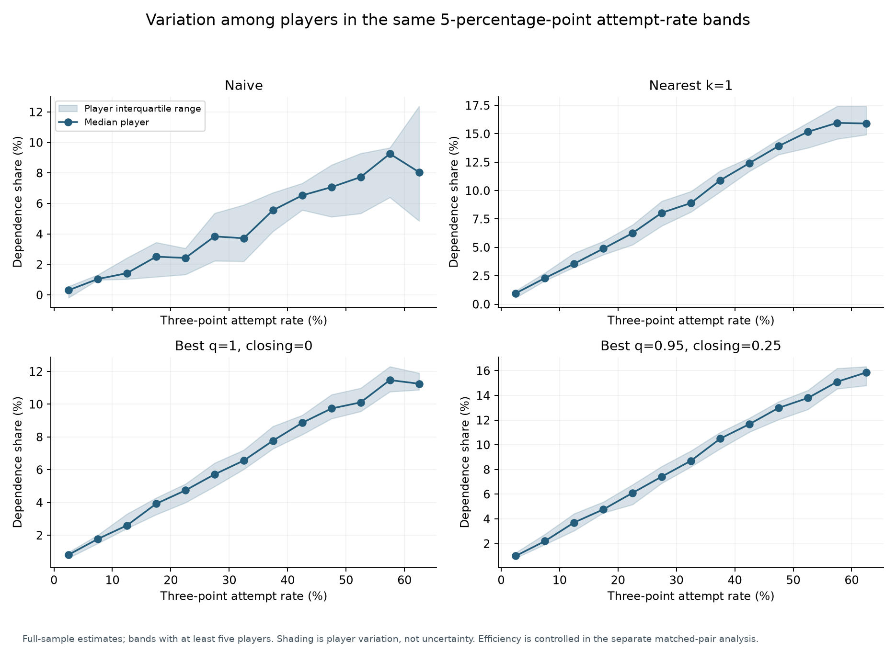
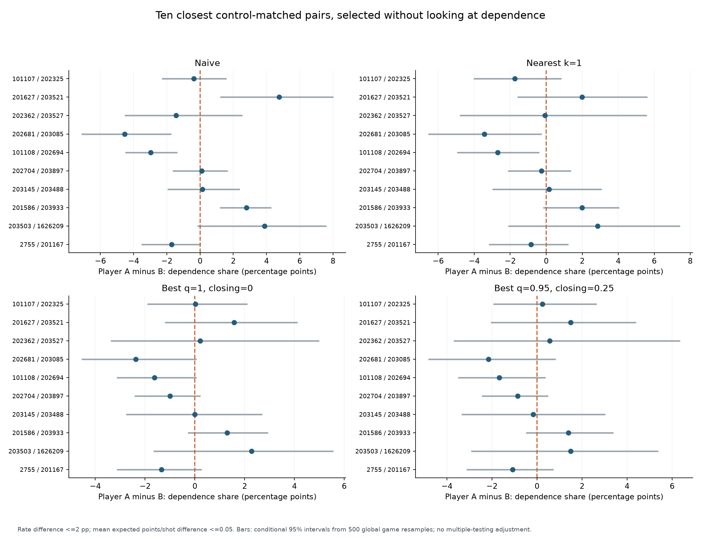
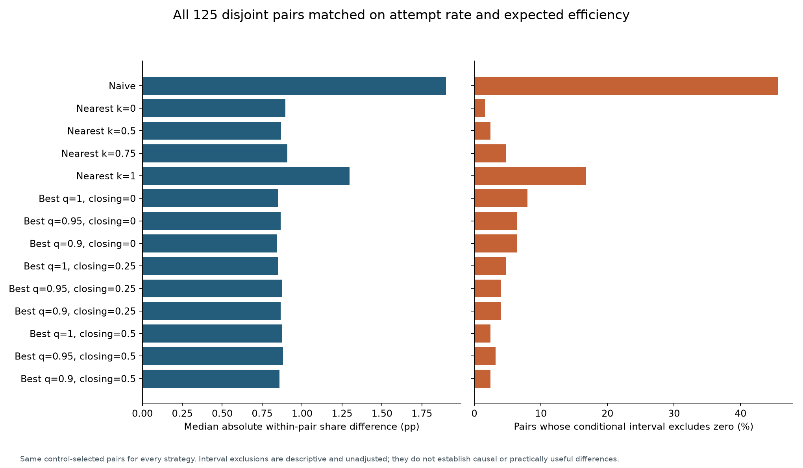
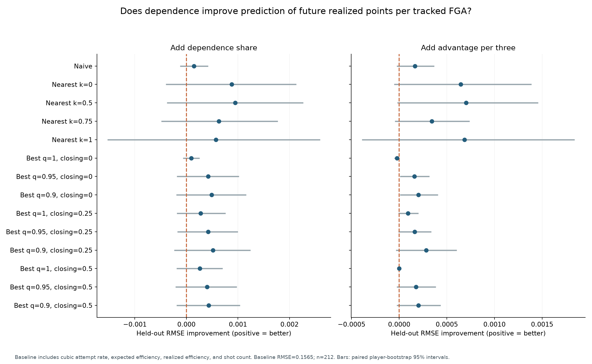
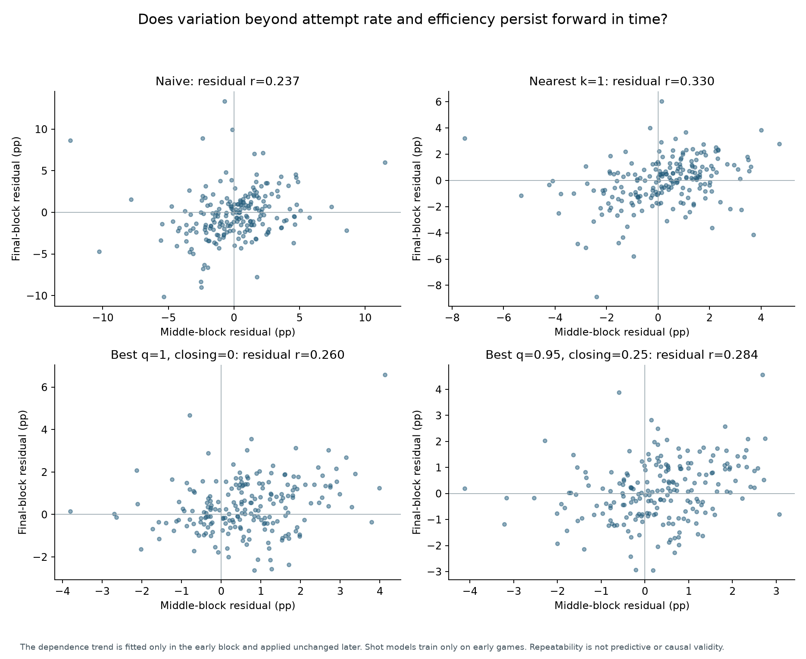
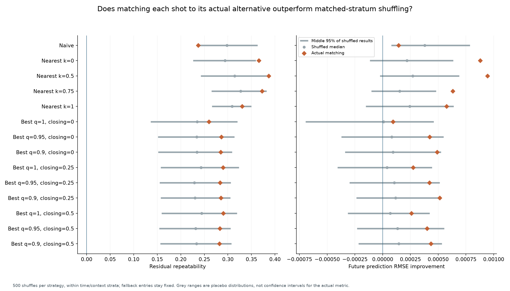

# Does dependence share add information beyond attempt rate?

This analysis implements three additional checks: control-matched player comparisons,
forward-time prediction, and matched-stratum shuffling of alternative values. It evaluates
the naive reference and all 13 nearest/best variants at the published 8 ft radius and
0.25 ft grid. No strategy is selected after examining the validation outcome.

**Finding:** dependence can distinguish some players with similar attempt rates and expected
efficiency. However, these experiments do not establish a reliable incremental prediction
benefit for `dep_share`, and much of its residual repeatability survives shuffling. The
results support a descriptive counterfactual scoring measure more strongly than a separately
validated player trait. Failure on this particular prediction target does not prove the metric
has no other use.

Recall the exact identity:

**Dependence share = attempt rate × average advantage per three ÷ average observed EP per shot.**

“Adds information beyond attempt rate” is therefore the relevant question. Independence from
attempt volume is not an expected property of this definition. All share differences below are
percentage points (pp), not relative percentages.

## 1. Players with similar attempt rates and efficiency

### Design

Use the existing full-sample results: 88,694 shots, 24,306 geometric threes, and 271 players
with at least 50 shots and 10 threes. Match players with:

- No more than **2 percentage points** difference in three-point attempt rate.
- No more than **0.05 expected points per shot** difference in overall modeled efficiency.

Efficiency is matched because it is the denominator in `dep_share`. Eligible edges are sorted
by the sum of squared differences normalized by these two tolerances. Greedily select the
closest available pair and remove both players. This produces **125 disjoint pairs**, covering
250 players. The same pairs are used for every strategy. This is a deterministic matching
heuristic, not a globally optimal matching algorithm.

Neither dependence nor future performance enters pair selection. In the example plot, the ten
pairs are the closest control matches, not the largest dependence differences. Orientation is
player A minus player B, so negative differences are meaningful.

For each strategy, recompute paired differences over **500 global game bootstrap resamples**.
Resampling the same games jointly for both players preserves their shared-game variation.
The models, replacement values, full-sample naive baselines, pair selection, and qualification
are held fixed. The resulting 95% intervals are conditional and not adjusted for testing many
pairs. The comparison does not control for every difference in role, shot mix, or opposition.

### Results

| Strategy | Median absolute paired difference | Pairs with intervals excluding zero |
|---|---:|---:|
| Naive | 1.900 pp | 45.6% |
| Nearest, equal openness | 1.296 pp | 16.8% |
| Best, maximum, no closing | 0.851 pp | 8.0% |
| Best, q=.95, closing=.25 | 0.876 pp | 4.0% |

These are genuine numerical differences after close matching on the two controls. They are
not automatically practically important, causal, or attributable solely to replacement quality.
Original three-point shot quality can also differ. In particular, 4% of unadjusted intervals
excluding zero is not persuasive evidence of a widespread difference beyond chance.

For a concrete example, player IDs 201627 and 203521 have attempt rates of approximately
50.649% and 50.691% and mean observed EP of 0.9848 and 0.9827. Their naive dependence difference
is 4.751 pp, with a conditional interval of approximately [1.201, 8.015] pp. Their naive
replacement EP values also differ, 0.8364 versus 0.8813. This illustrates separation, not a
validation of either player's counterfactual.



The first plot shows medians and interquartile ranges within 5-pp attempt-rate bands containing
at least five players. Its shading represents player variation, not confidence intervals;
efficiency is not controlled in that plot. The following matched analysis adds that control.





## 2. Forward-time residual stability and future scoring prediction

### Chronological separation

Split distinct observed game dates into 40%, 30%, and 30% blocks; all games on a date stay
together. The resulting sample is:

| Block | Dates | Games | Shots |
|---|---|---:|---:|
| Early | 2015-10-27 through 2015-11-30 | 212 | 35,546 |
| Middle | 2015-12-01 through 2015-12-26 | 159 | 26,554 |
| Final | 2015-12-27 through 2016-01-23 | 160 | 26,594 |

Train shot-probability models **only on early-block shots**. Early shots receive five-fold
game-grouped out-of-fold predictions. Middle and final shots use one model fitted to all early
shots. Re-score every candidate with the corresponding model, retaining the current search
rules. Thus later observed outcomes never train the shot-model weights used for this experiment.
Naive and fallback baselines are estimated separately within each block, never pooled across
blocks. Final-block dependence is used only for residual stability, not as a forecast input.

The experiment freezes the repository's existing features and hyperparameters. Those settings
were developed previously, so this is not a pristine prospective trial or independent-season
validation. The early predictions also use smaller cross-fitted training sets than the later
predictions. These limitations apply equally across the compared strategies.

### Prediction target and baseline

The primary target is **future realized points per tracking-matched field-goal attempt**:
sum of actual makes times source play-by-play shot value, divided by matched attempts. It
excludes free throws and unmatched attempts; it is not official team points per possession.
Source PBP labels determine this realized outcome, while corrected geometric labels determine
dependence. The target contains no candidate values or dependence subtraction.

Fit a ridge regression with fixed penalty alpha=1, with all scaling learned only from the
training rows. The baseline inputs are:

- Attempt rate, its square, and its cube.
- Mean modeled observed EP per shot.
- Realized points per matched FGA.
- Log of one plus the number of attempts.

Train the predictor on **early player features → middle player outcomes** (224 players).
Evaluate it on **middle player features → final player outcomes** (212 players). Feature
periods require at least 25 shots and 5 threes; outcome periods require at least 25 shots.
Player IDs are not predictors. Some players occur in both transitions: this tests forecasting
later performance, not generalization to entirely unseen players.

Add `dep_share` to the baseline and compare final-period root mean squared error (RMSE).
Separately add `dep_per_3pa` as a secondary analysis. Positive RMSE improvement means the
augmented model predicts better. Players have equal weight. Paired 95% intervals use 1,000
resamples of evaluation players and hold both fitted prediction models fixed. They omit
training/model uncertainty and team/game dependence across evaluation players.

### Prediction results

Baseline RMSE is **0.156533 points per tracked FGA**, compared with 0.161853 for predicting
the training-target mean for everyone. Adding dependence share gives:

| Strategy | RMSE improvement | Conditional 95% interval |
|---|---:|---:|
| Naive | 0.000144 | [-0.000124, 0.000420] |
| Nearest, equal openness | 0.000575 | [-0.001531, 0.002595] |
| Best, maximum, no closing | 0.000094 | [-0.000067, 0.000258] |
| Best, q=.95, closing=.25 | 0.000421 | [-0.000178, 0.000999] |

**Every one of the 14 `dep_share` improvement intervals includes zero.** The largest point
improvement is approximately 0.000945, or 0.60% of baseline RMSE, for nearest k=.5. This is
not convincing evidence of a practically substantial or reliably positive forecast gain.
It is a comparison against attempt rate **plus efficiency and volume controls**, not against
attempt rate alone.

Two secondary `dep_per_3pa` specifications (best q=.95 and q=.90, no closing) have narrowly
positive unadjusted intervals, with gains of approximately 0.000160 and 0.000203. They are
small, arise among multiple secondary comparisons, and should not be selected as validated
winners. All variants are retained in the table and plot.



### Residual stability results

Separately, fit a ridge trend of early dependence on cubic attempt rate and mean expected
efficiency. Apply this same early-fitted trend to middle and final players and correlate their
residuals. Both later blocks require 25 shots and 5 threes, leaving **206 players**.

Residual correlations are 0.237 for naive, 0.330 for equal-openness nearest, 0.260 for
maximum/no-closing best, and 0.284 for q=.95/closing=.25 best. The full family ranges from
approximately 0.237 to 0.387. Some remaining variation persists forward in time.

These values should not be directly interpreted as a correction factor for the earlier
split-half results: the time windows, player cohort, shot models, and efficiency adjustment
all differ. Persistence is also distinct from improving the prediction target above.



## 3. Does the actual shot-to-alternative matching matter?

### Placebo construction

Use the forward-time predictions and the same forecasting and residual tests. Within each
strategy, shuffle replacement EP values among comparable three-point shots, retaining original
observed EP, players, shot counts, and attempt rates. The fixed strata are:

- Chronological block.
- Predicted make-probability bins with cutoffs .35, .45, .55, .65.
- Shot-distance bins with cutoffs 23.75, 26, 30 ft.
- Nearest-defender-distance bins with cutoffs 4 and 8 ft.
- Shot-clock bins with cutoffs 4 and 10 seconds.
- Corner status: lateral distance from court center greater than 22 ft.

For location alternatives, fallback shots are held fixed and successful substitutions are
permuted only within their strata. A stratum must contain at least two eligible shots from
at least two players. Singleton or one-player groups stay fixed. Permutations can still leave
some values with the same player. For naive, all baseline replacements are eligible; that
tests player-specific baseline assignment rather than geographic candidate matching.

This preserves each stratum's replacement-value distribution while breaking individual
shot-to-replacement links. Eligibility for shuffling is approximately 99.75% for naive,
77.87% for equal-openness nearest, and 96.35% for best. Limited shuffling and preserved
fallbacks restrict how much signal this placebo can remove.

Run **500 shuffles for each of 14 strategies** (7,000 total). For each shuffle, refit the
early dependence trend and the early→middle augmented predictor, then evaluate the same
middle/final player cohorts. Baseline forecasts remain unchanged because their inputs do
not contain replacement values.

These are conditional perturbation diagnostics, not randomized causal experiments. The bins
do not make shots perfectly exchangeable, and shuffled values are not asserted to represent
physically feasible alternatives for their recipient shots.

### Results and interpretation

| Strategy | Actual residual r | Median shuffled r | Shuffles at least as high as actual r* |
|---|---:|---:|---:|
| Naive | 0.237 | 0.298 | 97.4% |
| Nearest, equal openness | 0.330 | 0.309 | 16.6% |
| Best, maximum, no closing | 0.260 | 0.235 | 28.9% |
| Best, q=.95, closing=.25 | 0.284 | 0.229 | 8.6% |

\*Tail fractions use `(1 + number of shuffles >= actual) / 501`. The plotted grey ranges
are the middle 95% of the shuffled statistics; they are not confidence intervals for the
actual metric.

Substantial residual repeatability survives shuffling. Therefore repeatability alone cannot
be credited to the correct shot-specific alternative assignments. In the naive case, the
shuffled baseline actually has higher median residual repeatability than the real baseline.
That does not make the shuffled rule more valid; it shows why maximizing repeatability would
be an inappropriate selection criterion.

The looser nearest variants show some unadjusted evidence that actual matching matters:
k=0 and k=.5 have residual tail fractions of approximately .018 and .020; k=.5 and k=.75
have prediction-gain tail fractions around .004. However, **none passes a .05 threshold after
Holm adjustment across the 14 strategies for either endpoint**. The smallest adjusted tail
fractions are approximately .251 for repeatability and .056 for prediction gain. This is
suggestive evidence to investigate, not a confirmed strategy advantage. Adjustment does not
repair the placebo's approximate exchangeability assumptions.



## Implication for the thesis

The matched analysis demonstrates numerical separation from attempt frequency and modeled
overall efficiency, most clearly for naive dependence. The forward-time analysis finds some
persistent residual differences. But incremental prediction gains are tiny and uncertain, and
the placebo demonstrates that substantial persistence does not require the actual alternative
matching. Together these results strengthen the case for reporting `dep_share` as **scoring
reliance under a stated replacement rule**, and weaken a stronger claim that the current local
alternatives establish a distinct, validated behavioral trait.

Keep attempt rate, advantage per three, and dependence share together. Passing or trajectory-aware
alternatives could be evaluated with the same framework, but should not be chosen simply for
lower correlation, larger residuals, or better results on this already-inspected test period.
A fresh season, additional forward windows, and a pre-specified substantively relevant endpoint
would be stronger confirmation. A valid descriptive reliance measure need not predict future
efficiency, so this result limits the tested usefulness claim rather than proving universal
uselessness.

## Reproduction and output files

From the repository root, with dependencies installed and the corrected processed data present:

```text
python src/experiments/prepare_temporal_validation.py
python src/experiments/dependence_validation.py --placebos 500
python src/experiments/dependence_validation_figures.py
python -m pytest tests -q
```

`prepare_temporal_validation.py` writes local fitted models and checkpoint arrays under
`results/metric_validation/cache/`; those are excluded from Git and do not replace the canonical
full-sample alternatives. It reuses the existing batched candidate engine and its input/model/code
fingerprint checks. If model inputs or preparation code change, archive or remove stale caches
before recomputation. The six figures can be regenerated from the versioned CSVs alone, without
raw tracking data or fitted model caches.

The tables in `results/metric_validation/` are:

| Files | Contents |
|---|---|
| `periods.csv`, `design.json` | Dates, sample counts, fixed analysis settings |
| `matched_players.csv`, `attempt_bands.csv` | Full-sample player estimates and within-band summaries |
| `matched_pairs.csv`, `matched_summary.csv` | All control-selected pairs, paired intervals, and strategy summaries |
| `period_players.csv` | Player metrics in each chronological block |
| `prediction_summary.csv`, `predictions.csv` | Both forecast comparisons, intervals, and individual held-out forecasts |
| `forecast_benchmark.csv` | Control-model and constant-prediction benchmark errors |
| `temporal_residuals.csv` | Middle/final residuals from the early-fitted trend |
| `placebo_draws.csv`, `placebo_summary.csv` | Every shuffle statistic, observed comparisons, and adjusted tail fractions |

Tests cover disjoint control matching, calipers, stratum/fallback preservation, chronological
date grouping, training-only scaling, period-specific baselines, the dependence identity, and
Holm adjustment. No raw snapshots, model binaries, working notes, or contact sheets are needed
to interpret the published tables and figures.
